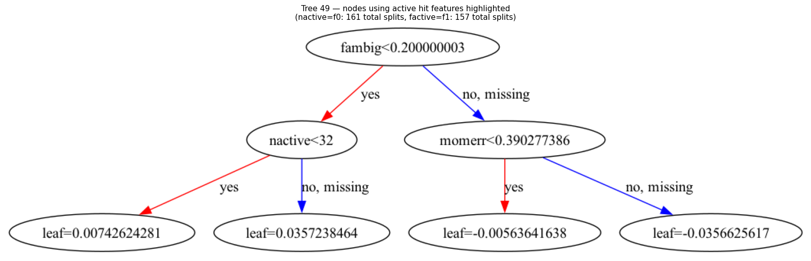

# Mu2e_XGboost_Project

This project documents a year of machine learning development focused on engineering an independent XGBoost classifier. This model serves as a robust cross-verification framework alongside the pre-existing Artificial Neural Network (ANN) model currently deployed in the Mu2e experiment's offline data pipeline.

**Note on Project History:** This repository represents a full year of continuous local development, engineering, and experimental refinement. It was committed to GitHub as a complete, stable, and unified codebase.


# 1) Tech Stack & Environment

This workspace utilizes a high-performance machine learning stack managed through an isolated Python virtual environment:

-   **Gradient Boosting:** `XGBoost` (Optimized with system-level `libomp` multi-threaded processing)
-   **Deep Learning Frameworks:** `TensorFlow` & `PyTorch` 
-   **Model Interoperability:** `ONNX` & `onnxruntime` (for cross-framework model deployment)
-   **Scientific Computing:** `NumPy`, `Pandas`, `Scikit-Learn`, `SciPy`
-   **Visualization & Tree Rendering:** `Matplotlib`, `Seaborn`, and `Graphviz` 

# 2) Quick Start / Local Setup

To clone this repository and recreate the exact package environment, ensure you have your Python interpreter active and execute the following steps:

a. **Clone the repository:**
   ```bash
   git clone https://github.com
   cd Mu2e_XGboost_Project
   ```

b. **Set up your local virtual environment:**
   ```bash
   python3 -m venv venv
   source venv/bin/activate
   ```

c. **Install dependencies:**
   ```bash
   pip install -r requirements.txt
   ```

*Note for macOS Users: If generating tree visualizations or running layout components locally, ensure your machine has `libomp` and `graphviz` binary dependencies installed via Homebrew.*



